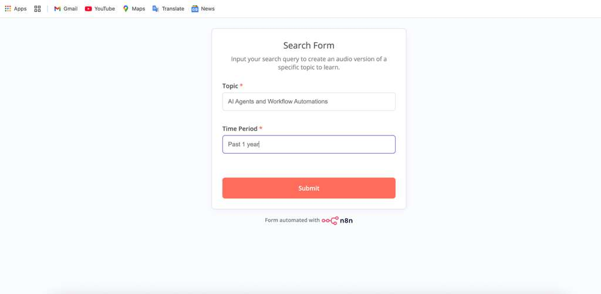

# 🧠 AI Research and Sound Bite Summarization Agent  

**Tech Stack:** n8n • Perplexity API • OpenAI Chat Models • Text-to-Speech (TTS)  

---

## 📘 Overview  

This project is a **no-code AI workflow built in n8n** that automates research and delivers **topic-based executive summaries as audio files** directly to a user’s inbox.  

It combines **AI-powered research, summarization, and voice generation** in one streamlined automation — no manual coding required.  

The agent takes a user-submitted topic, performs **AI-assisted research using the Perplexity API**, generates a structured summary using **OpenAI’s chat models**, and converts that summary into speech using **OpenAI TTS** — all within a single n8n workflow.  

---

## ⚙️ Key Features  

- 🧩 **Fully automated pipeline:** From topic input → research → summary → speech output.  
- 🧠 **AI summarization:** Uses OpenAI chat models to create concise and coherent summaries.  
- 🔊 **Audio delivery:** Converts summaries into sound bites and sends them to the user’s email inbox.  
- 🚀 **Error handling and optimization:** Debugged node mapping, implemented chunking logic to overcome input length limits, and ensured stable end-to-end execution.  
- 🎯 **Scalable design:** Optimized for single-user, single-topic execution for reliability and focused performance.  

---

## 🧰 Workflow Architecture  

### Visual Workflow  
You can visualize the process with screenshots (insert yours here 👇):   

#### 1️⃣ Form Input  
This is the user-facing form where a topic and time period are entered.  

#### 2️⃣ Automated Email Output  
The workflow automatically sends the generated audio summary to the user’s email inbox.  
  

#### 3️⃣ n8n Workflow Overview  
The full automation pipeline — connecting Perplexity API, OpenAI Chat Models, TTS, and Gmail nodes.  
  

## 🧪 Results  

- Produced reliable summaries in both **text and audio** formats.  
- Eliminated **blank audio output** and **TTS truncation** issues through prompt chunking.  
- Delivered **consistent, production-ready** audio summaries across multiple test topics.  

---

## 🔍 Use Cases  

- Automating daily research updates  
- Converting news, reports, or whitepapers into short audio briefs  
- Acting as a research assistant for content creators, journalists, or analysts  

---

## 📁 Repository Structure  

---

## 🧩 How to Reproduce  

1. Open **n8n** (cloud or local instance).  
2. Import the `.json` workflow (optional if you exported it).  
3. Add your **Perplexity API** and **OpenAI API** keys.  
4. Run the workflow — you’ll receive a summarized audio file in your inbox!  

---

## 🧠 Learnings  

- Designing **multi-step LLM automation** without traditional coding.  
- Managing **data chunking and context retention** for large language model responses.  
- Applying **API orchestration principles** to real-world AI pipelines.  

---

## 👩‍💻 Author  

**Riya Kalyan Kerur**  
Master’s Student, Computer Engineering — California State University, Sacramento  
📧 [riya.kerur2910@gmail.com](mailto:riya.kerur2910@gmail.com)  
🌐 [LinkedIn](https://www.linkedin.com/in/your-link)  

---
